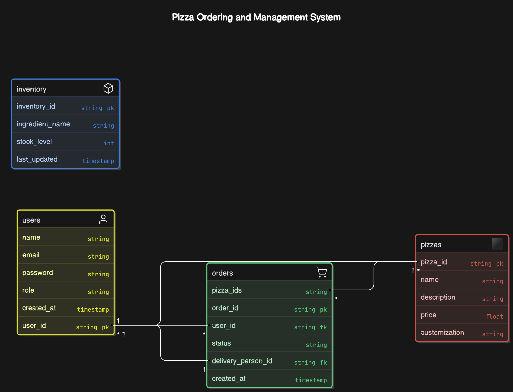
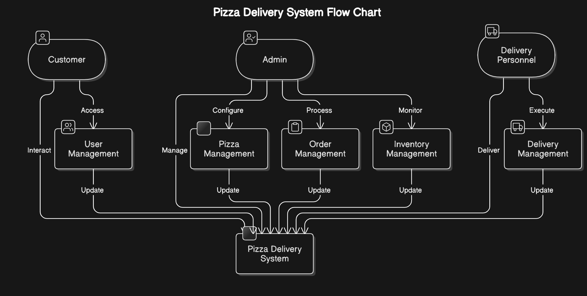

# Pizza Delivery 

## Overview  
The Pizza Delivery platform is a full-stack application designed to streamline the process of ordering, managing, and delivering pizzas. It includes separate functionalities for customers, admins, and delivery personnel. The platform ensures a seamless experience from order placement to delivery, with real-time updates and efficient management of inventory and orders.

---

## Features  

### Customer Functionality:  
- Register, login, and manage personal profiles.  
- Browse the pizza menu, customize pizzas, and place orders.  
- Track order status in real-time.  
- View order history and provide feedback.  

### Admin Functionality:  
- Manage users (customers and delivery personnel) and pizzas.  
- Monitor inventory and receive notifications for low stock.  
- Oversee orders and update their status.  
- Access platform-wide data for analytics and reporting.  

### Delivery Personnel Functionality:  
- View assigned orders and update their delivery status.  
- Access delivery history and customer feedback.  

---

## Technology Stack  
- **Backend:** Node.js, Express.js  
- **Frontend:** React.js, Tailwind CSS  
- **Database:** MongoDB  
- **Authentication:** JWT for secure role-based access control  

---

## Requirement Analysis  

### Stakeholder Needs  

#### 1. Customers:  
- Easy registration and login.  
- A user-friendly interface for browsing and ordering pizzas.  
- Real-time updates on order status.  

#### 2. Admins:  
- Tools for managing users, pizzas, and orders.  
- Inventory management with low-stock alerts.  
- Access to analytics and reports.  

#### 3. Delivery Personnel:  
- A system to view and update delivery assignments.  

### Platform Requirements:  
- Secure authentication and role-based access control.  
- Scalable backend to handle increasing users and orders.  
- Efficient inventory and order management.  

### Functional Requirements:  
- User registration and role-based authentication.  
- CRUD operations for pizzas, users, and orders.  
- Real-time order tracking.  
- Inventory management with notifications.  

### Non-Functional Requirements:  
- Scalability to accommodate growth.  
- High availability and performance.  
- Secure data handling.  
- Intuitive UI/UX for all roles.  

---

## API Documentation  

### Authentication Endpoints  

#### Customer Authentication  
- **POST /customer-register**: Register a new customer.  
- **POST /customer-login**: Login for customers.  
- **POST /customer-logout**: Logout from the platform.  

#### Admin Authentication  
- **POST /admin-register**: Register a new admin.  
- **POST /admin-login**: Login for admins.  
- **POST /admin-logout**: Logout from the platform.  

#### Delivery Personnel Authentication  
- **POST /delivery-register**: Register a new delivery personnel.  
- **POST /delivery-login**: Login for delivery personnel.  
- **POST /delivery-logout**: Logout from the platform.  

### Pizza Management Endpoints (Admin)  
- **POST /create-pizza**: Add a new pizza to the menu.  
- **POST /update-pizza**: Update pizza details.  
- **POST /delete-pizza**: Remove a pizza from the menu.  
- **GET /pizzas**: Retrieve the pizza menu.  

### Order Management Endpoints  

#### Customer  
- **POST /place-order**: Place a new order.  
- **GET /orders**: View order history.  
- **GET /order-status/:id**: Get the status of a specific order.  

#### Admin  
- **GET /all-orders**: View all orders.  
- **POST /update-order-status**: Update the status of an order.  

#### Delivery Personnel  
- **GET /assigned-orders**: View assigned orders.  
- **POST /update-delivery-status**: Update the delivery status of an order.  

### Inventory Management Endpoints  
- **GET /inventory**: View inventory details.  
- **POST /update-inventory**: Update inventory stock levels.  

---

## Entity-Relationship Diagram (ERD)  

## Data Flow Diagram (DFD)  

## Final Summary  

The **Pizza Delivery Platform** is a robust full-stack solution for managing pizza orders, inventory, and deliveries. It offers role-based functionalities for **customers**, **admins**, and **delivery personnel**, ensuring a smooth user experience and efficient management processes.  

Key highlights include:  
- Real-time order tracking.  
- Inventory management with low-stock notifications.  
- Secure role-based authentication.  
- Scalable architecture using **Node.js**, **React.js**, and **MongoDB**.  

With its intuitive design and efficient backend, the platform ensures a seamless flow of operations, from order placement to final delivery.  

---

**Thank You!** 😊  
This documentation provides a complete overview of the platform, including requirements, API endpoints, and system diagrams. Let me know if further refinements are needed!
